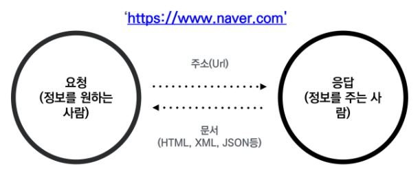

### 2021-07-15

---

### 저번 시간 복습

* Open Source 
  * 제작자의 권리를 지키면서 누구나 코드 열람이 가능한 오픈 소스 라이센스가 등장
  * 공동 참여 프로젝트들이 생겨나는 등의 생태계가 구성됨
* 왜 쉬워졌는가?
  * 프로그래밍 언어가 쉬워졌다.
  * 프로그래밍 환경이 좋아졌다.(오픈소스)


>#### "수레바퀴를 두 번 만들지 마라"
>
>모든 것을 바닥부터 만들지 않아도 된다.


>#### "거인의 어깨 위에서 프로그래밍 시작하기"
>
>이미 만들어진 것을 잘 활용하면 된다.


### Python 기초

#### 프로그래밍 언어 : 3형식

> 1. 저장
> 2. 조건(if)
> 3. 반복(while)


##### 1. 저장

```python
dust = 60

# dust는 60이다 (X)
# dust에 60을 저장(할당)한다. (O)
```

```python
dust == 60

# dust에 저장된 값은 60과 같다.
```


##### 무엇을 저장하는가?

1) 숫자

2) 글자

```python
a = 58     # a는 숫자이다.
b = '58'   # b는 글자이다.
```

3) 참/거짓

**True**, **False**  단 두 가지!!


##### 어떻게 저장하는가?

**1)  변수**

​	저장된 값을 변경할 수 있는(Variable) 박스

​	숫자, 글자, 참거짓을 담을 수 있다.

```python
dust = 58
dust = 60
print(dust)
```

```
60
```


**2) List**

박스의 리스트

박스가 순서대로 여러 개가 붙어있다.

```python
dust = [58, 40, 70]
print(dust[1])
```

```
40
```


**3) dictionary**

"견출지 붙인 박스들의 묶음"

```python
dust = {'영등포구' : 58, '강남구' : 40}
print(dust['영등포구'])
```

```
58
```


# Python 문법 맛보기

* f-string   (f'{---} ---')

```python
names = ['한지민', '한효주', '한가인']
for name in names:
    print(f'저는 {name}입니다. 반갑습니다.')
```

```
저는 한지민입니다. 반갑습니다.
저는 한효주입니다. 반갑습니다.
저는 한가인입니다. 반갑습니다.
```


## 웹 페이지 크롤링

> 조직적, 자동화된 방법으로 웹을 탐색하는 것



##### import.requests

```python
requests.get(주소)                # '주소'에 요청(request) 보내서, 정보를 받아줘(get)
requests.get(주소).text           # '주소'에 요청(request) 보내서, 정보를 받아서(get) 글(text)만 뽑아줘
requests.get(주소),status_code    # '주소'에 요청(request) 보내서, 정보를 받아서(get) 상태(status_code)만 뽑아줘
```


##### from bs4 import BeautifulSoup

```python
BeautifulSoup(문서)               # 받은 문서를 예쁘게(보기 좋게, 검색하기 좋게) 만들어줘
BeautifulSoup.select(경로)        # 문서 안에 있는 특정 내용을 뽑아줘(select)
BeautifulSoup.select_one(경로)    # 문서 안에 있는 특정 내용을 하나만 뽑아줘(select_one)	
```


>### 파이썬이 주소에 대한 요청을 보내고(requests)
>
>### 그 응답 결과를 예쁘게 관리한다.(bs4)


#### (예제1)

```python
# 0. requests 패키지를 가져온다.
import requests
from bs4 import BeautifulSoup

# 1. url을 준비한다.
url = 'https://finance.naver.com/sise/'

# 2. 파이썬으로 요청을 보낸 결과를 저장
response = requests.get(url).text
print(response)

# 3. 정보 추출을 위해서, BeautifulSoup으로 문서 구조화
data = BeautifulSoup(response)

# 4. 선택자를 활용해서 해당 위치를 찾고
kospi = data.select_one('#KOSPI_now')

# 5. 내용을 출력한다.
print(kospi.text)
```


#### (예제2)

```python
# 0. 패키지 불러오기
import requests
from bs4 import BeautifulSoup

# 1. url 요청
url = 'https://finance.naver.com/marketindex/'
response = requests.get(url).text

# 2. 문서를 구조화
data = BeautifulSoup(response, 'html.parser')
print(data)

# 3. 선택자를 활용하여 정보 가져오기
dollar = data.select_one('#exchangeList > li > a > div > span.value').text
print(f'달러 환율은 {dollar}입니다.')
```


## API 활용하기


### JSON (JacaScript Object Notation)

데이터만을 주고 받기 위한 표기법

파이썬의 Dictionary와 List 구조로 쉽게 변환하여 활용할 수 있다.


#### (API 예제)

```python
# 요청 보내주는 requests 를 가져온다.
import requests

url = 'https://api.agify.io?name=michael'

# 저장하는데, 이거 json이라서 리스트-딕셔너리 구조로 바꿔줘!
response = requests.get(url).json()
response_text = requests.get(url).text

print(response)
print(type(response))
print(response['age'])
print('===================')
# 저장하는데, 이거 text로 바꿔줘 -> BeautiSoup으로 구조화를 (HTML) -> 선택자
```

```
{'name': 'michael', 'age': 69, 'count': 233482}
<class 'dict'>
69
```


### API (Application Programming Interface, 응용 프로그램 프로그래밍 인터페이스)

> 응용 프로그램에서 사용할 수 있도록, 
>
> 운영 체제나 프로그래밍 언어가 제공하는 기능을 제어할 수 있게 만든 인터페이스


##### 웹에서 API

* 서비스와 서비스 간의 프로그래밍을 통한 대화 방식
* 요청을 받는 측에서 일정한 방식을 명세
* 해당 방식대로 요청을 하면 정보 제공


##### API 예시

* 페이스북 로그인
* 카카오통 API
* 네이버 지도
* Riot API
* 공공데이터 API


### 크롤링과 API의 차이점


#### 크롤링

* 브라우저를 통해 사용하던 웹문서(HTML)를 파이썬으로 요청
* BeautifulSoup으로 웹 문서 구조 형태로 변형
* 선택자를 활용하여 원하는 데이터 활용


#### API

* 데이터를 교환하기 위한 JSON 파일을 파이썬으로 요청
* JSON을 쉽게 파이썬 문법(List/Dictionary)로 변형
* 데이터 구조를 활용하여 원하는 데이터 활용
* (나중에는 요청을 통해 특정 기능을 제어하기도 한다.)
